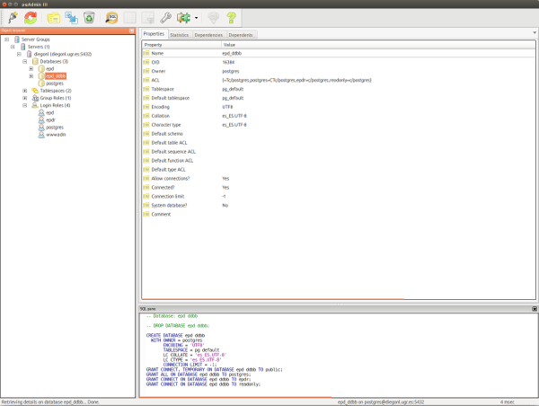

In this vignette we will explain and illustrate how to install a PostgreSQL server in Windows and Ubuntu, and how to mirror the European Pollen Database (EPD) into the server. The general procedure include the next steps:

1. Download and install PostgreSQL server
2. Download EPD data for PostgreSQL
3. Setup PostgreSQL for EPD:
    + Create mandatory users for EPD
    + Create a database for EPD into the server
4. Dump EPD data into the new database


# Download and install PostgreSQL server

The first step is to download and install the PostgreSQL server. This step changes depending on your operating system (OS). Select your OS in the tabs below.

## Windows

You can download Windows binary files of PostgreSQL server latest version, which include the graphical interface pgAdminIII, from [https://www.postgresql.org/download/windows/](https://www.postgresql.org/download/windows/). Currently (2016/06/13), there are two providers: EnterpriseDB and BigSQL. BigSQL provides a much richer installation of the server with a lot of complements that are intended for developers and that will be useless for a low profile user. Hence, I recommend to use binary files from EnterpriseDB. The file name should looks like `postgresql-XXXX-windows-YYY.exe` (Xs indicate the version number and Ys the computer architecture: x86 or x64). 


Installation wizard starts with a double click on the binary file (as any other Windows program). Then, it allows you to change the values for different configuration parameters: installation directory, data directory, or the communication port. You can change those or use the default values. It is important to remember those values (specially if you change them). Next, the installation wizard ask you for a password (has to be filled twice). This password is for a special user of the database called "postgres". This user is the default superuser or administrator of the database server. User "postgres" can create new users, databases, etc. It is important to provide a password for security reasons and to remember it, otherwise you won't be able to make any operation with the server.


When the installation wizard is over, you have to modify the setup in Windows path to include the `bin` folder in the installation directory of PostgreSQL. This allows you to run PostgreSQL commands in the command line from any folder in your computer. To do so, you need to right click on `System`, then sequentially click on `Properties`, `Advanced Setup`, `Env. Variables`, `System Variables`, and `Edit`. Then, at the end of the text box you have to include the address of the installation directory you especified during the installation wizard plus `\bin`. If you used the default values it should be something like this: 

```
; C:\Program Files\PostgreSQL\X.X\bin
```

Note that the directory address has to be separated by semicolumn (;) from the rest of directories in your system path. Note also that X.X has to be changed to match the version of PostgreSQL you installed.

## Ubuntu

Ubuntu, and most Linux distributions, include PostgreSQL server in their package repositories. Hence, installing PostgreSQL server is straightforward with the default package manager of the distribution. In Ubuntu, you can use Synaptic to search for the `postgresql` package and the `pgAdminIII` package. Installing these two packages should install the server and all necessary dependencies, and setup the required configuration. Here, the installation will create a superuser (or administrator) account called "postgres" in the server and will ask you to specify a password for this user. It is important to provide a password for security reasons and remember it, otherwise you won't be able to make any operation with the server.

# Download EPD data for PostgreSQL

Now you have to download the lastest version of the EPD for Postgres from [http://www.europeanpollendatabase.net/data/downloads/](http://www.europeanpollendatabase.net/data/downloads/). Save the file `epd-postgres-distribution.zip` in a specific folder of your choice and unzip the file. Now you should have four files `dumpall_epd_db.sql.gz`, `dump_epd_db_schema_only.sql`, `dumps_epd_all_tables.zip`, and `README`. The file `dumpall_epd_db.sql.gz` is also compressed and has to be uncompressed to obtain the file `dumpall_epd_db.sql`.


# Setup PostgreSQL for EPD:

Before we can dump the EPD data into the server, you need to perform two basic configuration steps:

1. Create two specific users in the PostgreSQL server
2. Create an empty database in the server

These two steps can be done from the command line or from the graphical user interface pgAdminIII.

## Command line

Once you are in the command line, use command `cd` to change to the same directory you unzipped the database files.

```
diego@server:~$ cd epd-postgres-distribution
```

Then, use the `psql` command to start working with the PostgreSQL server, which will change the prompt to let you know you are in a PostgreSQL prompt. Specifically, you specify that want to connect to the server with the superuser `-U postgres` and the address of the server (`-h localhost`).

```
diego@server:~/epd-postgres-distribution$ psql -U postgres -h localhost
Password for user postgres:
psql (9.5.3)
SSL connection (protocol: TLSv1.2, cipher: ECDHE-RSA-AES256-GCM-SHA384, bits: 256, compression:off)
Type "help" for help.

postgres=#
```

### Create mandatory users for EPD

First, you should create two specific users in your local PostgreSQL server: `wwwadm` and `epd`. These two users are defined in the original EPD database server and are required to properly dump the data into the database in your local server. Users in PostgreSQL are also know as roles. To create a new role for the server we use the `CREATE ROLE` command, with the argument `WITH PASSWORD` to specify the desired password for each user. You can use any password of your choice, but do not forget these passwords.

```
postgres=# CREATE USER wwwadm WITH PASSWORD 'wwwadm_password';
CREATE ROLE
postgres=# CREATE USER epd WITH PASSWORD 'epd_password';
CREATE ROLE
```

### Create a database for EPD into the server

Now, you can create a database for the EPD with the `CREATE DATABASE` command. In the example, we created a database called `epd` but you can select a different name if you want. Note that commands in postgresql prompt end with semicolom `;`.

```
postgres=# CREATE DATABASE epd;
CREATE DATABASE
```

## pgAdminIII

pgAdminIII is a graphical user interface to manage PostgreSQL servers. It eases basic operations with PostgreSQL databases for no-advanced users that are used to work with the command line. It is also usefull to visually inspect tables in the database. If you want to give it a try or use it instead of the command line, you should look for pgAdminIII in your system and run it.

The program interface have three different parts: a side bar pannel in the left (`Object browser`) with the structure of the server and all its elements (databases, users, etc) and two pannels at the right. The right upper pannel provides details (`Properties`, `Statistics`, `Dependencies`, and `Dependents`) for the element that is selected in the left pannel and the right bottom pannel (`SQL pane`) shows text details of the selected element in SQL language.



### Create mandatory users for EPD

To create new users (or roles) you have to right click on `Login Roles` element in the `Object browser` pannel and, then, left click on `New Login Role...`. A new window popup. In the first tab of the window (`Properties`) you have to provide a `Role name`, which is just the name for the new user. Here, you have to write `epd`. In the next tab (`Definition`) you have to provide twice the password for the new user. You can use any password of your choice. Do not change any other option in this window and click `Ok`.

Repeat the same proccess to create a new role called `wwwadm`.

### Create a database for EPD into the server

To create a new database you have to right click in `Databases` element in the `Object browser` pannel and, then, left click on `New Database...`. A new window popup. In the first tab of the window (`Properties`) you have to provide a `Name` for the database. You can use any name of you choice, but it is a good practice to provide an informative name (e.g., `epd`). Do not change any other option and click `Ok`. 

# Dump EPD data into the new database

Dumping EPD data into the DDBB server requires to use the command line, and cannot be accomplished in pgAdminIII. To do so, once you are in the command line, use the `cd` command to move into the same folder you downloaded and uncompressed the EPD database for PostgreSQL. Then, you use the `psql` command to connect to the `epd` database in the PostgreSQL server as the `postgres` user. In the same line of code you use the `<` symbol to parse all the `dumpall_epd_db.sql` script for PostgreSQL into the database you just created (`epd`). 

```
diego@server:~$ cd epd-postgres-distribution
diego@server:~/epd-postgres-distribution$ psql -U postgres -h localhost -d epd < dumpall_epd_db.sql
.
.
.
REVOKE
REVOKE
GRANT
GRANT
REVOKE
REVOKE
GRANT
GRANT
REVOKE
REVOKE
GRANT
GRANT
REVOKE
REVOKE
GRANT
GRANT
REVOKE
REVOKE
GRANT
GRANT
diego@server:~/epd-postgres-distribution$ 
```

Now, you can use the database from the pgAdminIII software or using the EPDr package for R.

